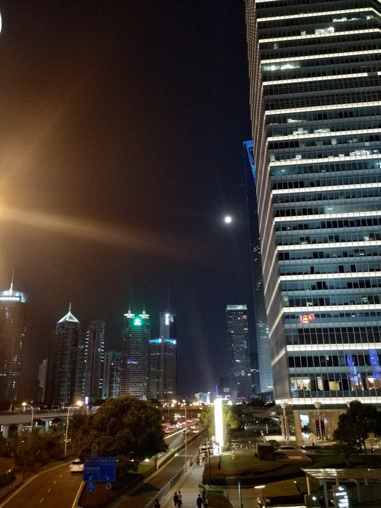

去年今日，婚姻大事。今日已经又回到上海了，岁月流转，感觉时间越来越快了。毕竟不是孤身一人在上海了，有亲爱的老婆在身边，即使再远，也有守望的人。

三天假期，去了南京二天，一天逛了上海。节日的气氛不是很浓了，但月亮还是那么远。

-------------

南京总统府如此之小，又如此之大，可以装的下整个政府系统。

明孝陵，的确可以称得上中国最大的还保存较好的陵墓，其实地面上的建筑也只有石头保存的较好，你能看到的任何一颗树都不会超过100年。

中山陵比孝陵的位置要高，连里面的石碑也要特意高过孝陵，以后任何人的墓也不能超过它。

南京博物院，里面有丰富的文物展示，比我去过的任何博物馆都多，即使是在北京也没见这么多过。

二天的时间看的匆匆忙忙，但避过了十一的人流高峰，终于是到了这个一直想来的城市。

上海的繁华还是挺美的。

